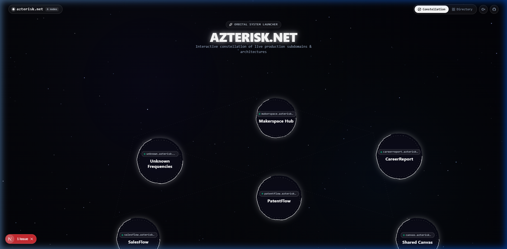
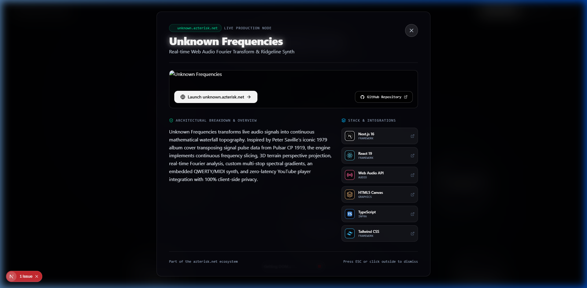
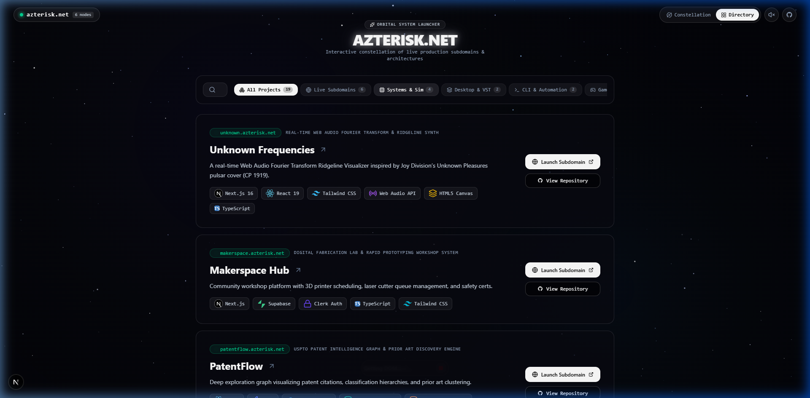

# azterisk.net 🌌

> **Personal Portfolio Hub, Interactive Constellation Gateway & Subdomain Launcher**

[](https://azterisk.net)
[](https://nextjs.org)
[](https://react.dev)
[](https://www.typescriptlang.org)
[](https://tailwindcss.com)
[](https://www.framer.com/motion)

---

## 📸 Visual Showcase

### 1. Interactive Orbital Constellation
The root gateway features a real-time stardust particle void, hand-drawn organic SVG constellation nodes with continuous weightless floating physics, and pixel-calibrated dynamic boundary connection lines.



---

### 2. Orbiting Technology Stack Satellites & Modal Showcase
Hovering or tapping any constellation node expands its surrounding satellite bubbles—displaying the exact technology stack with category tags. Clicking the node triggers a smooth full-screen modal showcasing architecture details, screenshots, and live launch links.



---

### 3. Dual-Mode Filterable Project Directory
Toggle into **Directory Mode** for a high-density, searchable portfolio list featuring real-time stack filtering (Live Subdomains, Systems & Sim, Desktop & VST, CLI & Automation, Games & 3D).



---

## 🌐 Live Subdomain Ecosystem

All primary web applications are active production nodes deployed as dedicated subdomains under `azterisk.net`:

| Node / Project | Live Subdomain | Stack Highlights | Description |
| :--- | :--- | :--- | :--- |
| **Unknown Frequencies** | [unknown.azterisk.net](https://unknown.azterisk.net) | Next.js 16, Web Audio API, Canvas, Tailwind | Real-time Fourier Transform waterfall spectrogram & ridgeline synthesizer inspired by Pulsar CP 1919. |
| **CareerReport** | [careerreport.azterisk.net](https://careerreport.azterisk.net) | Next.js, Supabase DB, Clerk, Gemini AI, Stripe | AI executive career brief and automated ATS resume optimization engine with deterministic PDF generation. |
| **SalesFlow** | [salesflow.azterisk.net](https://salesflow.azterisk.net) | React PWA, IndexedDB Offline, Mapbox GIS | Offline-first field CRM and spatial territory prospecting PWA for zero-connectivity sales canvassing. |
| **PatentFlow** | [patentflow.azterisk.net](https://patentflow.azterisk.net) | React, Vite, USPTO Open Data, Apache Solr | Interactive patent citation network graph and prior art whitespace discovery engine. |
| **Shared Canvas** | [canvas.azterisk.net](https://canvas.azterisk.net) | TanStack Start, SpacetimeDB, Rust, WebSockets | Multiplayer infinite collaborative pixel canvas with sub-10ms binary WebSocket synchronization. |
| **Makerspace Hub** | [makerspace.azterisk.net](https://makerspace.azterisk.net) | Next.js, Supabase, Clerk Auth, Tailwind CSS | Digital fabrication lab scheduling, 3D printer queues, and safety certification management system. |

---

## 🛠️ Standalone & Systems Projects

The directory also indexes offline systems, native desktop applications, compilers, and game engines:

* **[World_Sim](https://github.com/Azteriisk/World_Sim)** — Multi-layer Earth system and geological planetary ecosystem simulator in Rust.
* **[SpectralSubtractor](https://github.com/Azteriisk/SpectralSubtractor)** — Real-time DSP spectral subtraction noise reduction VST3 plugin in C++ / JUCE.
* **[PseudoIDE](https://github.com/Azteriisk/PseudoIDE)** — Offline-first privacy AI pseudocode translation IDE in Rust and TypeScript.
* **[GameChat](https://github.com/Azteriisk/gamechat)** — Ultra-lean native desktop chat client built with Rust and Slint UI supporting Matrix federation.
* **[CRM-Term](https://github.com/Azteriisk/CRM-Term)** — Blazing fast terminal-based CRM in Go with SQLite persistence and Vim keybindings.
* **[Stage](https://github.com/Azteriisk/stage)** — Browser-based live-coding performance environment linking Strudel music runtime to GLSL shaders.
* **[SSLB](https://github.com/Azteriisk/sslb)** — Turing-complete shader language transpiler and interactive 3D runner in Rust.
* **[CS-330 Portfolio](https://github.com/Azteriisk/CS-330-Portfolio)** — Comprehensive OpenGL 3D computer graphics coursework portfolio in C++ / GLFW.
* **[Quickswitch UI](https://github.com/Azteriisk/quickswitch-ui)** — Next.js template switching engine with GPU WebGL particle canvas.
* **[Terminal Portfolio](https://github.com/Azteriisk/terminal-emulator)** — Retro UNIX terminal portfolio with simulated virtual filesystem.
* **[Netflix Visualizer](https://github.com/Azteriisk/Netflix-Visualizer)** — Canvas particle simulation clustering global streaming trends.
* **[Free-Bot](https://github.com/Azteriisk/free-bot)** — Automated Discord bot tracking limited-time free game promotions.
* **[MeshNet](https://github.com/Azteriisk/MeshNet)** — GPU-accelerated 3D browser mesh rendering engine in WebGL.
* **[Vulkan Pipeline](https://github.com/Azteriisk/Vulkan_Tests)** — Low-level cross-platform graphics engine in native C++ and Vulkan.
* **[SDLOdin](https://github.com/Azteriisk/SDLOdin)** — 2D game engine exploring data-oriented design and SDL2 in Odin.
* **[OneLastMission](https://github.com/Azteriisk/OneLastMission)** — 3D tactical stealth adventure game in Unreal Engine 5 with Nanite and Lumen.

---

## 🏗️ Architecture & Key Technologies

```
azterisk/
├── app/
│   ├── globals.css              # Glassmorphism tokens, cosmic animations, glow shaders
│   ├── layout.tsx               # Root metadata, fonts (Outfit, Plus Jakarta Sans, JetBrains Mono)
│   └── page.tsx                 # Viewport coordinator (Constellation vs. Directory view)
├── components/
│   ├── Constellation.tsx        # Dynamic galaxy cluster layout & exact line trimming
│   ├── ConstellationNode.tsx    # Organic wobbly SVG nodes, smooth glow transitions
│   ├── SatelliteOrbit.tsx       # Orbiting tech stack bubbles with interactive docs links
│   ├── ProjectModal.tsx         # Full-screen layoutId viewport morphing showcase
│   ├── ProjectListView.tsx      # Filterable, searchable portfolio directory view
│   ├── SpaceVoid.tsx            # Real-time HTML5 canvas stardust particle engine
│   ├── Header.tsx               # Status indicator, tech stack hover card, view toggles
│   └── Icons.tsx                # Custom SVG brand and tech icons
├── config/
│   └── projects.ts              # Single source of truth for all projects, metadata, & stacks
└── public/
    └── screenshots/             # High-resolution project captures for modals and README
```

---

## 🚀 Getting Started

### Prerequisites
- Node.js 18.x or later
- npm or pnpm

### Installation

```bash
# Clone the repository
git clone https://github.com/Azteriisk/azterisk.git
cd azterisk

# Install dependencies
npm install

# Run local development server with Turbopack
npm run dev
```

Open [http://localhost:3000](http://localhost:3000) in your browser.

### Production Build

```bash
# Compile optimized production bundle
npm run build

# Start production server
npm run start
```

---

## 📄 License

MIT License © 2026 Alec ([Azteriisk](https://github.com/Azteriisk))
